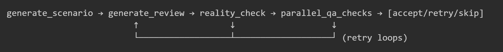

# Synthetic Review Data Generator

A simple tool that generates synthetic product reviews using Large Language Models (LLMs). Built with LangChain and LangGraph. This generator creates realistic, diverse reviews while maintaining quality through semantic similarity checks, sentiment alignment, and facts/reality validation.

## Features

- **Multi-Model Support**: Works with OpenAI, Ollama, and Mistral AI models
- **Persona-Based Generation**: Generate reviews from different user perspectives (CEO, Trainer, L&D Manager, etc.)
- **Quality Assurance**: Built-in checks for semantic similarity, sentiment alignment, and reality validation
- **Research Integration**: Optional web research to ground reviews in real product information
- **Comprehensive Reporting**: Automated quality reports, comparison metrics, and performance summaries
- **REST API**: FastAPI-based API for integration with other services (though I personally used `app.py` to generate the results presented in this repo)
- **Docker Support**: It'll work on your machine, too!

## Challenge & Solution
The goal was to generate various reviews that are diverse and non-repetitive, while keeping them relevant, factual, and non-hallucinated. If we rely on pure randomness, the result would be a bunch of irrelevant reviews written by someone who clearly never sued the target product. If we made a deterministic generator, the reviews will be very repetitive. We also have the problem of having the generated reviews look more like a commercial that an actual feedback. So these are the ideas and approaches I used to overcome these challenges:

### Factual real-world data (research)
Before starting the generation loop, a research agent step runs for each of the products listed inside `config.json`. It searches for two types of information:
- **Official product features**: What features does the official website *claims* to have.
- **General customer reviews**: What people have experienced using this product.

The agent uses **BrightData MCP** to search for resources, and extract their content. (the reason I used BrightData is because it has an "extract as Markdown" feature that makes extracted content easier to read for LLMs).

The agent then makes a **research report** consisting of:
- Product features
- Reviews summary
- Gaps between official claims and real-world feedback

which becomes a knowledge base for the generator (and later for the fact/reality checker) to use.
Note: You can see examples of research report in `data\research`, and there you can also find an example of what resources the agents finds (see `research_easygenerator_20260103_200623.md`)

### Diversity without losing relevance (scenario generation + feature shuffling)
If you just ask the LLM to "write a different review", you'll get the same review with different words. So I made the diversity happen *before* the review writing step.

**How it works:**
1. The LLM extracts a list of features from the research report.
2. For each review, the features get shuffled, then a random selection picks which features to assign (weighted so fewer features is more likely).
3. Before writing the review, the persona gets their assigned features and writes a *usage scenario* - a short story of how they used those features.
4. The review is then written based on this scenario, not just "write a review".

So two reviews from the same persona will be different because they're based on different scenarios and features. The randomness happens before the writing, which keeps reviews relevant while making them varied. 
This also was what solved the "this sounds like a commercial" issue, since the review now is a feedback from an actual use-case instead of being a mere features summarization.

**Other diversity tricks:**
- Random LLM parameters (temperature, top_p, frequency/presence penalties)
- Random length instructions ("brief 2-3 sentences" vs "detailed with examples")

### Preventing hallucinations (reality check)
Even though we're relying on a (somewhat) knowledge base, with high temperature settings, LLMs like to invent features or make up claims. The **reality check** is another LLM node that validates each review against the research report.

**How it works:**
1. After generating a review, it goes to the reality checker.
2. The checker compares what the review says against what's in the research.
3. If the review mentions features that don't exist or makes false claims, it fails.
4. Failed reviews get regenerated (up to 3 tries).
5. If all tries fail, the review is skipped (better to have no review than a hallucinated one).

### Ensuring semantic diversity (similarity check)
Even with scenarios, the LLM sometimes still wrote similar reviews. The **similarity check** uses embeddings to make sure each new review is different enough from all previous ones.

**How it works:**
1. Each accepted review (that passed the reality/fact check) gets embedded using a local model (`all-MiniLM-L6-v2`; I just went with the most famous open-source model on HuggingFace).
2. New reviews get compared against all previous embeddings using cosine similarity.
3. If similarity is above the threshold (default 0.8), the review gets regenerated.
4. The system keeps track of the "best" (least similar) review across tries.
5. After 5 tries, it uses the best one found instead of blocking forever.

I used a local embedding model (instead of API) so similarity checks are fast and free.

### Matching sentiment to rating (sentiment alignment)
A common problem is when a review sounds like 5 stars but it was actually supposed to be 2 stars. The **sentiment alignment check** makes sure the review tone matches the rating.

**How it works:**
1. An LLM node reads the review (without knowing the rating) and guesses what rating it sounds like.
2. If the guess is within ±1 of the actual rating, it passes.
3. Failed reviews get regenerated.
4. If after 3 tries it still doesn't match, the system looks at all the guessed ratings, and does one of two things: 
   1. If there's a consistent guess (mode), it changes the review's rating to match the its tone (this is cheeper than regenerating a new review, and is as effective).
   2. If each guess has a different rating, then this review is confusing, and the review will be skipped.

### The QA pipeline (putting it together)
All the checks run in a LangGraph workflow:



- **Reality check** runs first - no point checking similarity of a hallucinated review
- **Sentiment + Similarity** run together - both must pass
- **Retry limits** prevent infinite loops
- **Skip mechanism** makes sure bad reviews never get to output

## What else could've been done?
### Personas research
Instead of relying on simple description in confing, we could scrap Linkedin for a list of people with the same persona's job, make a summary about each one of them (without their personal information, of course), and use these as different personas characters/personalities. This will give even more diverse and realistic results.
### Upgrading Product Research to the next level
Instead of just searching for features and reviews, we could search for user manuals and documentations. This will give us even more accurate scenarios, which will lead to more true-to-reality reviews.

## Trade-offs
### Using small models
To cut cost, I had to generate reviews using small models, which has lead to a higher average similarity score between reviews that what could have been given if I used larger models

### One review per call
I could've found a way to make the model generate multiple reviews at once, saving a big portion of tokens spent on instructions prompt (including research report), but with all the customization's I've made (giving a different scenario, different set of features, different model parameters) it seemed safer and less complicated to just generate one review at a time

### Multiple LLM calls per review
One review needs scenario generation + review writing + reality check + sentiment check. That's 4+ LLM calls per accepted review, and more if it fails any of the checks. 
Generation would've been faster/cheaper with one call, but quality would drop.

### Reality check sensitivity
This is a very strict check. Even in reality, not all users are honest, but I decided to keep it that way here.

## Table of Contents

- [Installation](#installation)
- [Quick Start](#quick-start)
- [Configuration](#configuration)
- [Usage](#usage)
  - [CLI](#cli)
  - [REST API](#rest-api)
- [Docker](#docker)
- [Project Structure](#project-structure)
- [API Reference](#api-reference)

## Installation

### Prerequisites

- Python 3.10 or higher
- pip or conda package manager
- API keys for your chosen LLM provider(s)

### Local Installation

1. **Clone the repository**
   ```bash
   git clone <repository-url>
   cd "Synthetic Data Generator"
   ```

2. **Create a virtual environment** (recommended)
   ```bash
   # Using venv
   python -m venv venv
   source venv/bin/activate  # On Windows: venv\Scripts\activate
   
   # Or using conda
   conda create -n synthetic-generator python=3.11
   conda activate synthetic-generator
   ```

3. **Install dependencies**
   ```bash
   pip install -r requirements.txt
   ```

4. **Set up environment variables**
   
   Create a `.env` file in the project root:
   ```env
   # For OpenAI
   OPENAI_API_KEY=your-openai-api-key
   
   # For Mistral AI (optional)
   MISTRAL_API_KEY=your-mistral-api-key

   # For BrightData (to use web research feature)
   BRIGHTDATA_API_KEY=your-brightdata-api-key   
   ```

5. **Verify installation**
   ```bash
   python -c "from modules.graph import build_graph; print('Installation successful!')"
   ```

## Quick Start

1. **Using default configuration**
   ```bash
   python app.py
   ```

2. **Using custom configuration file**
   ```bash
   python app.py --config my_config.json
   ```

3. **Using JSON string configuration**
   ```bash
   python app.py --config '{"products": [{"name": "MyProduct", "type": "SaaS", "description": "A great product"}], "personas": [{"role": "User", "description": "Regular user"}], "rating_distribution": {"1": 0.1, "2": 0.1, "3": 0.2, "4": 0.3, "5": 0.3}, "models": [{"provider": "openai", "name": "gpt-4o-mini"}], "samples_number": 5, "similarity_threshold": 0.7, "options": {"pros_and_cons": true, "rating": true, "use_research": false}}'
   ```

- Generated reviews will be saved at `data\output` (last generated reviews file has the largest timestamp signature)
- Generated reports will be saved at `reports\run_XXXXX_XXXXX` (including my favorite file `run.log` -- I've turned into a debugging worm)
- Last generated research reports will be saved at `data\research`
## Configuration

The configuration file (`config.json`) defines the generation parameters:

```json
{
    "products": [
        {
            "name": "Easygenerator",
            "type": "E-learning platform",
            "description": "Cloud-based e-learning platform for creating online courses."
        }
    ],
    "personas": [
        {
            "role": "Instructional Designer",
            "description": "Focuses on course creation efficiencies and learner engagement."
        },
        {
            "role": "CEO",
            "description": "Focuses on business value, ROI, and scalability."
        }
    ],
    "rating_distribution": {
        "1": 0.1,
        "2": 0.1,
        "3": 0.2,
        "4": 0.3,
        "5": 0.3
    },
    "models": [
        {
            "provider": "openai",
            "name": "gpt-4o-mini"
        }
    ],
    "samples_number": 10,
    "similarity_threshold": 0.8,
    "options": {
        "pros_and_cons": true,
        "rating": true,
        "use_research": true
    }
}
```

### Configuration Options

| Field | Type | Description |
|-------|------|-------------|
| `products` | array | List of products to generate reviews for |
| `personas` | array | List of reviewer personas |
| `rating_distribution` | object | Probability distribution for ratings (1-5) |
| `models` | array | LLM configurations (provider + name) |
| `samples_number` | integer | Number of reviews to generate |
| `similarity_threshold` | float | Max similarity allowed between reviews (0.0-1.0) |
| `options.pros_and_cons` | boolean | Include pros/cons sections in reviews |
| `options.rating` | boolean | Include ratings in reviews |
| `options.use_research` | boolean | Enable web research for context |

### Supported Model Providers

| Provider | Example Models | Notes |
|----------|---------------|-------|
| `openai` | `gpt-4o-mini`, `gpt-4o`, `gpt-5-nano` | Requires `OPENAI_API_KEY` |
| `ollama` | `llama3.1`, `mistral`, `mixtral` | Run Ollama locally |
| `mistral` | `mistral-small-latest` | Requires `MISTRAL_API_KEY` |

## Usage

### CLI

```bash
# Basic usage with default config
python app.py

# Custom config file
python app.py --config path/to/config.json

# JSON string config (useful for scripts/automation)
python app.py -c '{"products": [...], ...}'

# Help
python app.py --help
```

### REST API

Start the API server:

```bash
# Using Python directly
python api.py

# Using uvicorn (recommended for production)
uvicorn api:app --host 0.0.0.0 --port 8000 --reload
```

The API will be available at `http://localhost:8000`.

#### Key Endpoints

| Endpoint | Method | Description |
|----------|--------|-------------|
| `/` | GET | Health check |
| `/generate` | POST | Start async generation job |
| `/generate/sync` | POST | Run generation synchronously |
| `/generate/default` | GET | Start generation with default config |
| `/jobs` | GET | List all generation jobs |
| `/jobs/{job_id}` | GET | Get job status |
| `/outputs` | GET | List generated output files |
| `/outputs/{filename}` | GET | Download output file |
| `/reports` | GET | List generated reports |
| `/config/default` | GET | Get default configuration |

#### Example API Usage

```bash
# Start a generation job
curl -X POST "http://localhost:8000/generate" \
  -H "Content-Type: application/json" \
  -d '{
    "products": [{"name": "MyApp", "type": "SaaS", "description": "A productivity app"}],
    "personas": [{"role": "User", "description": "Regular user"}],
    "models": [{"provider": "openai", "name": "gpt-4o-mini"}],
    "samples_number": 5
  }'

# Check job status
curl "http://localhost:8000/jobs/{job_id}"

# List outputs
curl "http://localhost:8000/outputs"

# Download output
curl "http://localhost:8000/outputs/reviews_gpt-4o-mini_20260104_120000.json"
```

## Docker

### Building the Image

```bash
docker build -t synthetic-data-generator .
```

### Running with Docker

**Run the API server:**
```bash
docker run -p 8000:8000 \
  -e OPENAI_API_KEY=your-api-key \
  -v $(pwd)/data:/app/data \
  -v $(pwd)/reports:/app/reports \
  synthetic-data-generator
```

**Run CLI mode:**
```bash
docker run --rm \
  -e OPENAI_API_KEY=your-api-key \
  -v $(pwd)/data:/app/data \
  -v $(pwd)/reports:/app/reports \
  -v $(pwd)/config.json:/app/config.json \
  synthetic-data-generator python app.py --config config.json
```

**Run with custom config JSON:**
```bash
docker run --rm \
  -e OPENAI_API_KEY=your-api-key \
  -v $(pwd)/data:/app/data \
  synthetic-data-generator python app.py --config '{"products": [...], ...}'
```

### Docker Compose

Create a `docker-compose.yml`:

```yaml
version: '3.8'

services:
  generator:
    build: .
    ports:
      - "8000:8000"
    environment:
      - OPENAI_API_KEY=${OPENAI_API_KEY}
    volumes:
      - ./data:/app/data
      - ./reports:/app/reports
      - ./config.json:/app/config.json
    restart: unless-stopped
```

Run with:
```bash
docker-compose up -d
```

## Project Structure

```
Synthetic Data Generator/
├── app.py                 # CLI application
├── api.py                 # FastAPI REST API
├── config.json            # Default configuration
├── Dockerfile             # Docker configuration
├── requirements.txt       # Python dependencies
├── .env                   # Environment variables (create this)
├── data/
│   ├── real_reviews.json  # Reference reviews for comparison
│   └── output/            # Generated reviews
├── modules/
│   ├── embedder.py        # Embedding utilities
│   ├── graph.py           # LangGraph workflow
│   ├── metrics.py         # Performance tracking
│   ├── prompts.py         # LLM prompts
│   ├── QA.py              # Quality assurance checks
│   ├── reporting.py       # Report generation
│   ├── research.py        # Web research module
│   └── utils.py           # Utility functions
├── reports/               # Generated quality reports
└── tests/                 # Test files
```

## Output Format

Generated reviews are saved as JSON with the following structure:

```json
[
    {
        "title": "Excellent e-learning platform",
        "reviewer_role": "Instructional Designer",
        "comment": "The platform has transformed how we create courses...",
        "pros": "Easy to use, great templates, excellent support",
        "cons": "Some advanced features require learning curve",
        "rating": 5,
        "product_name": "Easygenerator"
    }
]
```

## Troubleshooting

### Common Issues

1. **Import errors**: Ensure all dependencies are installed:
   ```bash
   pip install -r requirements.txt
   ```

2. **API key errors**: Verify your `.env` file contains the correct API keys

3. **Ollama connection errors**: Ensure Ollama is running locally:
   ```bash
   ollama serve
   ```

4. **Memory issues**: For large batch sizes, consider reducing `samples_number` or using a smaller embedding model

### Logs

Generation logs are saved to `reports/last_run.log` for debugging.

## License

[Add your license here]

## Contributing

[Add contribution guidelines here]
